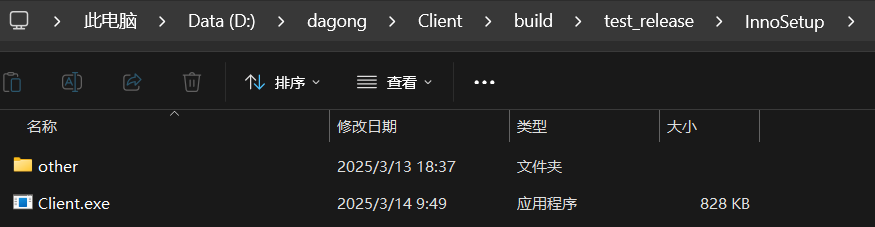
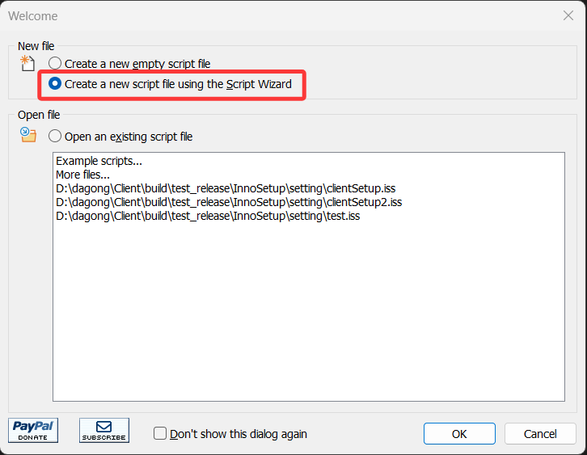
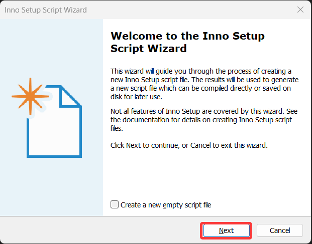
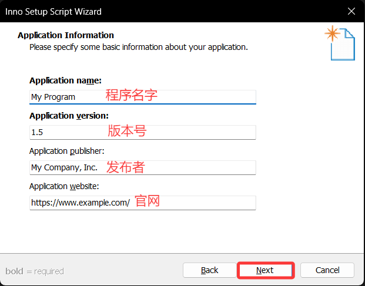
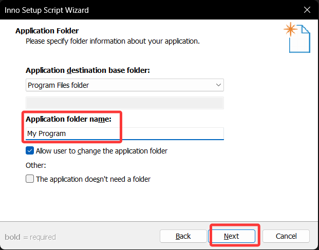
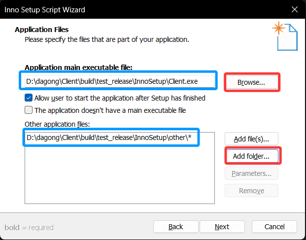

# 使用 InnoSetup 制作安装包

## `InnoSetup` 是什么？

**Inno Setup** 是一款专为 Windows 平台设计的开源免费工具，用于**将应用程序及其相关文件打包成专业的安装程序**。使用脚本语言 （`.iss` 文件）自定义安装流程，支持灵活定制安装行为。

- <https://github.com/jrsoftware/issrc>

但是**它并不能帮你打包依赖**，你需要自行先将程序的所有依赖寻找到，也就是做好“*打包*”，然后你才能使用它来生成一个安装包。

## 下载安装 `InnoSetup`

我们可以通过官网去下载它的最新版本 [`innosetup-6.4.2.exe`](https://files.jrsoftware.org/is/6/innosetup-6.4.2.exe)。

安装没有什么好说的，一直点即可。

## 前期准备

你需要先将你的程序完全的打包好，比如你的 `.exe` 程序可能依赖许多的动态库、配置文件，均需要复制到同级目录。

然后新建一个目录，将除了程序本身的所有依赖放到另一个文件夹中，例如：

## 添加中文语言支持

Inno Setup 默认不包含中文语言包，需要手动下载[简体中文翻译文件](https://raw.githubusercontent.com/jrsoftware/issrc/main/Files/Languages/Unofficial/ChineseSimplified.isl)。

下载后，将文件放入 Inno Setup 安装目录的 `Languages` 文件夹中。在该文件夹内，你会发现多个 `.isl` 文件，它们分别对应不同语言的翻译。

## 使用示例，为一个程序制作安装包

双击打开安装好的 Inno Setup Complier。

1. 然后选择使用安装向导的方式创建脚本，点击 OK 后开始。

    

    

2. 填写程序相关信息：

    `Application name` 应用程序的名字。
    `Application version` 应用程序的版本号（v1.0）。
    `Application publishe`r 应用的发布者。
    `Application website` 应用程序的官网。

    

3. `Application folder name` 是安装地址的文件夹名字，比如用户如何选择把程序安装到 `D:/` 那么就自动再创建一个文件夹（名字就是 `Application folder name`） 将程序放入，那么程序路径可能是：`D:/client/`。一般这个值可以不用改，就自动填上的程序名即可。

     

4. 选择应用的执行文件，也就是启动程序 `.exe`；以及相关的资源文件和依赖。点击圈住的红色按钮进行设置，一个是可执行文件路径，一个是之前“**前期准备**”中创建的存放依赖的目录。

     